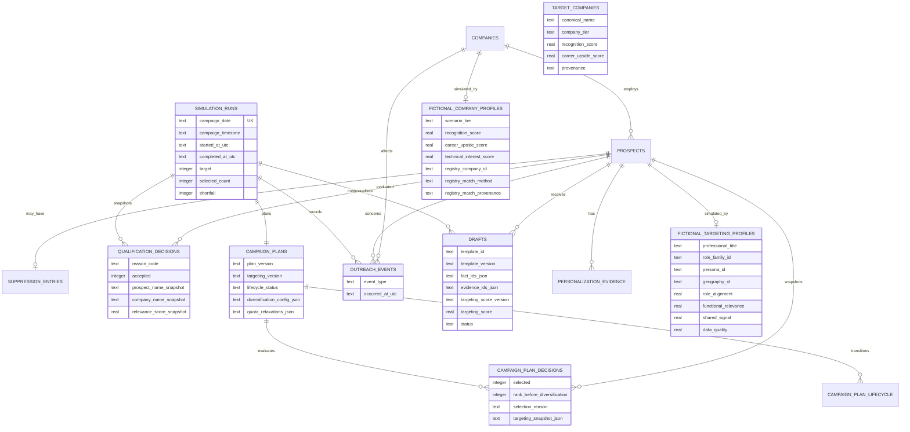

# Simulation schema

`campaign_plan_decisions.targeting_snapshot_json` is the immutable planning record: normalization provenance, profile and strategy versions, recipient and company inputs, registry alias provenance, score/components/explanations, hard-gate result, rank, final selection state, and reason. Drafts consume selected snapshots instead of mutable profiles. The older qualification and relevance snapshot columns remain migration-compatible but are no longer written by targeting-first planning.

`campaign_settings` stores local campaign configuration, including the IANA timezone and fictional-dataset marker. `schema_migrations` records applied migration filenames. Runtime `.sqlite`, WAL, and journal files are ignored and never committed.
