# Simulation schema

```mermaid
erDiagram
  COMPANIES ||--o{ PROSPECTS : employs
  PROSPECTS ||--o| SUPPRESSION_ENTRIES : may_have
  SIMULATION_RUNS ||--o{ QUALIFICATION_DECISIONS : snapshots
  SIMULATION_RUNS ||--|| CAMPAIGN_PLANS : plans
  CAMPAIGN_PLANS ||--o{ CAMPAIGN_PLAN_DECISIONS : evaluates
  CAMPAIGN_PLANS ||--o{ CAMPAIGN_PLAN_LIFECYCLE : transitions
  PROSPECTS ||--o{ CAMPAIGN_PLAN_DECISIONS : snapshots
  PROSPECTS ||--o{ QUALIFICATION_DECISIONS : evaluated
  SIMULATION_RUNS ||--o{ OUTREACH_EVENTS : records
  PROSPECTS ||--o{ OUTREACH_EVENTS : concerns
  COMPANIES ||--o{ OUTREACH_EVENTS : affects
  SIMULATION_RUNS ||--o{ DRAFTS : contextualizes
  PROSPECTS ||--o{ DRAFTS : receives
  PROSPECTS ||--o{ PERSONALIZATION_EVIDENCE : has
  PROSPECTS ||--o| FICTIONAL_TARGETING_PROFILES : simulated_by
  COMPANIES ||--o| FICTIONAL_COMPANY_PROFILES : simulated_by
  IMPORT_BATCHES ||--o{ IMPORTED_CANDIDATES : contains
  IMPORTED_CANDIDATES ||--o{ CANDIDATE_REVIEW_AUDIT : audited_by
  GMAIL_DRAFT_OPERATIONS ||--o| MANUAL_OUTREACH_RECORDS : may_be_confirmed_as
  PROSPECTS ||--o{ MANUAL_OUTREACH_RECORDS : concerns
  COMPANIES ||--o{ MANUAL_OUTREACH_RECORDS : starts_cooldown_for
  MANUAL_OUTREACH_RECORDS ||--o{ MANUAL_OUTREACH_AUDIT : audited_by
  IMPORTED_CANDIDATES ||--o| CANDIDATE_SUPPRESSION_ENTRIES : may_have

  SIMULATION_RUNS {
    text campaign_date UK
    text campaign_timezone
    text started_at_utc
    text completed_at_utc
    integer target
    integer selected_count
    integer shortfall
  }
  QUALIFICATION_DECISIONS {
    text reason_code
    integer accepted
    text prospect_name_snapshot
    text company_name_snapshot
    real relevance_score_snapshot
  }
  CAMPAIGN_PLANS {
    text plan_version
    text targeting_version
    text lifecycle_status
    text diversification_config_json
    text quota_relaxations_json
  }
  CAMPAIGN_PLAN_DECISIONS {
    integer selected
    integer rank_before_diversification
    text selection_reason
    text targeting_snapshot_json
  }
  OUTREACH_EVENTS {
    text event_type
    text occurred_at_utc
  }
  DRAFTS {
    text template_id
    text template_version
    text fact_ids_json
    text evidence_ids_json
    text targeting_score_version
    real targeting_score
    text status
  }
  TARGET_COMPANIES {
    text canonical_name
    text company_tier
    real recognition_score
    real career_upside_score
    text provenance
  }
  FICTIONAL_TARGETING_PROFILES {
    text professional_title
    text role_family_id
    text persona_id
    text geography_id
    real role_alignment
    real functional_relevance
    real shared_signal
    real data_quality
  }
  FICTIONAL_COMPANY_PROFILES {
    text scenario_tier
    real recognition_score
    real career_upside_score
    real technical_interest_score
    text registry_company_id
    text registry_match_method
    text registry_match_provenance
    integer registry_alias_reviewed
  }
  IMPORT_BATCHES {
    text adapter_id
    text dataset_classification
    text source_fingerprint UK
    text safe_source_snapshot_json
    text state
  }
  PROVIDER_DAILY_BUDGETS {
    text provider_id PK
    text local_date PK
    integer attempted_candidates
    integer estimated_max_exposure
    integer observed_consumption
  }
  PROVIDER_OPERATIONS {
    text provider_id
    text batch_id
    text operation
    text state
    integer estimated_max_exposure
    integer observed_consumption
    integer attempt_count
  }
  MANUAL_OUTREACH_RECORDS {
    text draft_snapshot_id UK
    text gmail_operation_id UK
    text candidate_id
    text company_id
    text identity_source
    text confirmation_source
    text confirmed_at_utc
    text effective_sent_at_utc
    text outcome
    text operation_version
  }
  MANUAL_OUTREACH_AUDIT {
    text event_type
    text outcome
    text confirmation_source
    text occurred_at_utc
  }
```

`campaign_plan_decisions.targeting_snapshot_json` is the immutable planning record: validated source identity/fingerprint, `classification-v1`, normalized title and derived classifications, fictional employer, separate authoritative strategy-company match/method/provenance, registry score inputs, targeting score/components/explanations, hard-gate result, rank, final selection state, and reason. Drafts consume selected snapshots instead of mutable profiles. The older qualification and relevance snapshot columns remain migration-compatible but are no longer written by targeting-first planning.

`campaign_settings` stores local campaign configuration, including the IANA timezone and fictional-dataset marker. `schema_migrations` records applied migration filenames. Runtime `.sqlite`, WAL, and journal files are ignored and never committed.

`provider_daily_budgets` and `provider_operations` store conservative Apollo enrichment authorization, attempts, optional observed credit use, and controlled failure categories. They contain no credentials or response payloads. Import batch snapshots retain safe provider identity and version metadata; immutable normalized snapshots retain field provenance.

`manual_outreach_records` stays separate from Gmail draft operations. A row exists only after deliberate local operator confirmation that the operator already sent the message outside NetworkPilot. Its effective timestamp is surfaced as an `operator-confirmed-manual-send` domain event for prior-person and company-cooldown policy. Migration `0010` adds terminal `hard-bounce`, surfaced as `operator-reported-hard-bounce`: it preserves permanent person/address suppression while limiting company cooldown to the campaign-local day. `manual_outreach_audit` records the initial confirmation and every changed human-reported outcome, including a distinct `hard-bounce-reported` event. Draft snapshot content remains immutable and is not copied into either table.

`candidate_suppression_entries` extends the existing suppression boundary to provider-ready candidates that are not materialized as simulation prospects. Repository reads overlay these durable entries as non-overridable suppression and preserve the normalized source snapshot unchanged.
