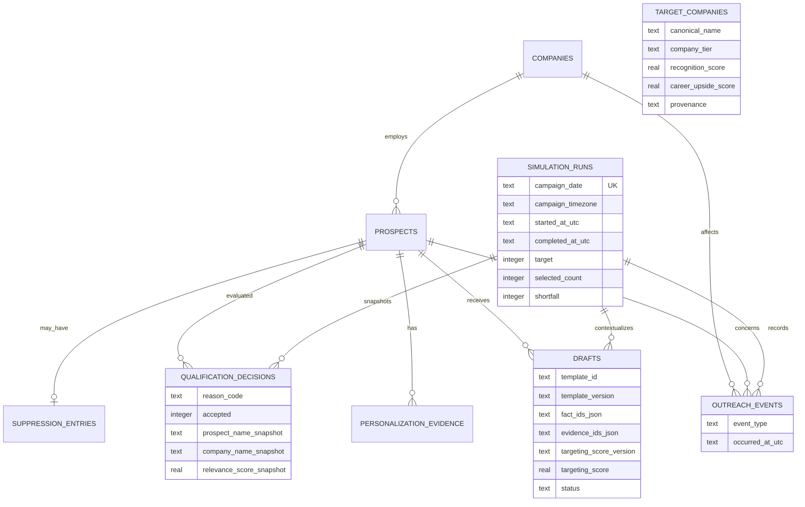

# Simulation schema

`campaign_settings` stores local campaign configuration, including the IANA timezone and fictional-dataset marker. `schema_migrations` records applied migration filenames. Runtime `.sqlite`, WAL, and journal files are ignored and never committed.
